# App Sequence Diagram (Who talks to who?)

```mermaid
sequenceDiagram
    autonumber
    participant User as 👤 User
    participant Frontend as 🖥️ Frontend (Browser)
    participant Auth as 🛡️ Authentication (The Bouncer)
    participant AuthZ as 🔐 Authorization (The Gatekeeper)
    participant Controller as 🤵 Controller (The Waiter)
    participant Repo as 📚 Repository (The Librarian)
    participant DB as 💽 Database (SQLite)

    Note right of Auth: 🛡️ Hybrid Auth: Checks HttpOnly Cookie first.<br/>Fallbacks to Authorization Header (for API testing).

    Note over User, Frontend: Phase 1: The Order
    User->>Frontend: Clicks "Book Room"
    Frontend->>Auth: GET /api/bookings (Browser automatically sends Cookie)

    Note over Auth, Controller: Phase 2: Authentication
    Auth->>Auth: 1. Check req.cookies.auth_token
    Auth->>Auth: 2. Check Header (Fallback)
    Auth->>DB: SELECT * FROM sessions WHERE token = "..."

    alt Invalid/No Token?
        alt Is API Request?
            Auth-->>Frontend: 401 Unauthorized ⛔
        else Is HTML Page Request?
            Auth-->>Frontend: Redirect to /login ↩️
        end
    else Valid Token
        Auth->>DB: SELECT * FROM users WHERE id = session.user_id
        Auth->>AuthZ: next() (User attached to req.user) ✅
    end

    Note over AuthZ, Controller: Phase 3: Authorization
    alt Role Allowed?
        AuthZ->>Controller: next() ✅
    else Insufficient Role
        AuthZ-->>Frontend: 403 Forbidden ⛔
    end

    Note over Controller, DB: Phase 4: Processing
    Controller->>Repo: createBooking(roomId, userId...)
    Repo->>DB: INSERT INTO bookings...
    DB-->>Repo: Success (Row ID: 42)
    Repo-->>Controller: Returns Result

    Note over Controller, User: Phase 5: Response
    Controller-->>Frontend: 201 Created (JSON)
    Frontend->>User: Alert("Booking Confirmed! 🎉")
    Frontend->>Frontend: Reloads Room List

    Note over User, Frontend: Phase 6: Logout
    User->>Frontend: Clicks "Logout"
    Frontend->>Auth: DELETE /api/auth/logout
    Auth->>DB: DELETE session
    Auth-->>Frontend: 200 OK + Set-Cookie: auth_token=; Max-Age=0
```

# The Architecture Diagram (Physical Structure)

```mermaid
graph TD
    subgraph Client ["🍽️ Dining Room (Frontend)"]
        User((👤 User))
        Browser["🖥️ Browser / public/"]
        Cookie[("🍪 HttpOnly Cookie (Auth Token)")]
        LS[("User Data / localStorage")]
    end

    subgraph Server ["The Kitchen (Backend)"]
        App["⚙️ App.js"]

        subgraph Logic ["The Staff"]
            CP["🍪 CookieParser"]
            MW["🛡️ Middleware (Auth + AuthZ)"]
            Route["📜 Routes"]
            Ctrl["🤵 Controllers"]
            Repo["📚 Repositories"]
            Utils["🧰 Utils"]
        end

        DB[("💽 SQLite Database")]
    end

    %% Connections
    User -- Clicks Button --> Browser
    Browser -- 1. Auto-includes Cookie --> CP
    CP -- Parses req.cookies --> App

    App --> Route
    Route --> MW
    MW -- Validates Session in DB --> DB
    MW -- If Valid & Authorized --> Ctrl

    Ctrl -- Asks for Data --> Repo
    Repo -- SQL Query --> DB

    DB -- Raw Data --> Repo
    Repo -- Data --> Ctrl
    Ctrl -- JSON Response --> Browser
    Browser -- Updates UI --> User
```


