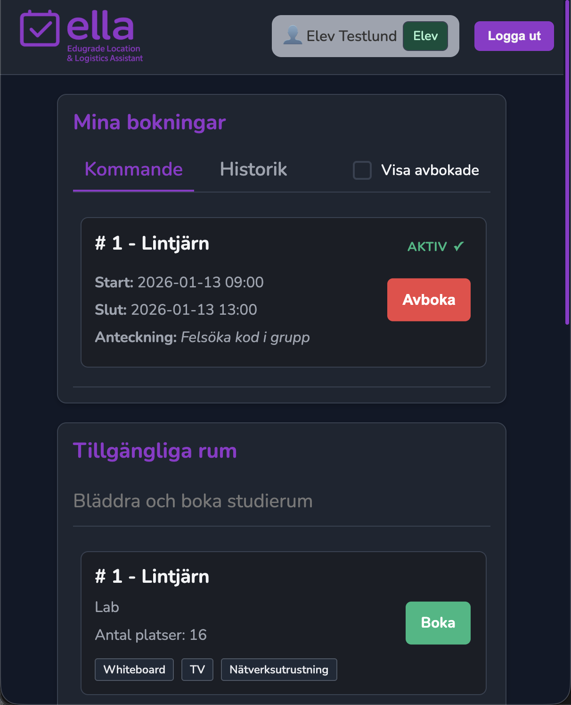

# ELLA Screenshots

*__/docs/screenshots__* folder contains all the screenshots of the ELLA application in both dark and light mode.

## Login Page
.png)
*Secure login interface with role-based authentication*

## Student Dashboard
.png)
*Students can view and book available rooms*

## Teacher Dashboard
.png)
*Teachers have priority booking access*

## Admin Dashboard
.png)
*Complete system overview with statistics*

## Room Management
.png)
*Admin interface for managing rooms*

.png)
*Admin interface for managing room details*

## User Management
.png)
*Admin interface for managing users*

.png)
*Admin interface for managing user details*

## Booking Modal
.png)
*Intuitive booking interface with validation*

## Mobile Responsive

*Fully responsive design for all devices*

